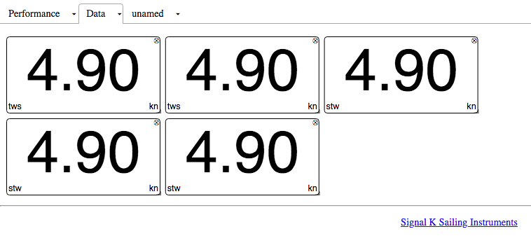
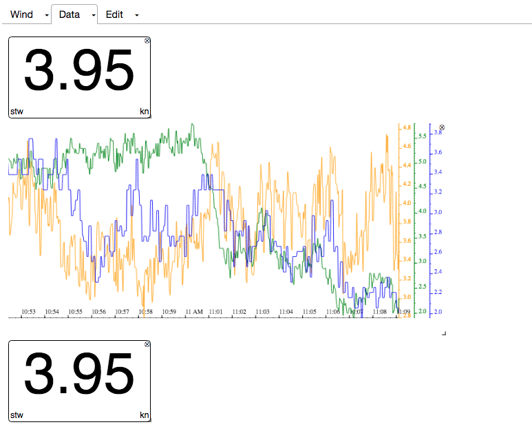
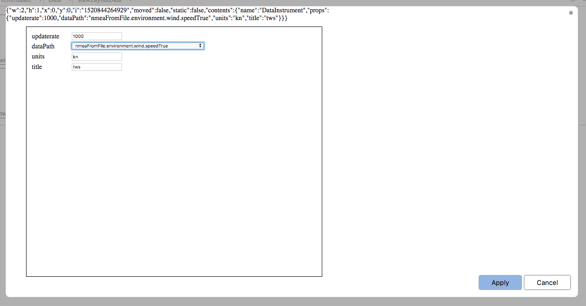
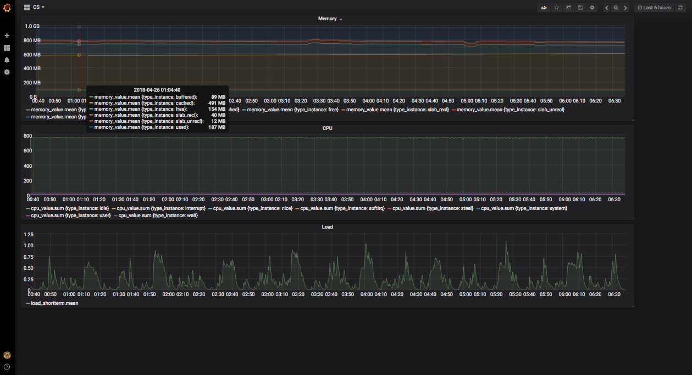

# Sailing Instuments for SignalK

This plugin contains instruments for SignalK designed to run in a browser on a tablet or laptop. The instruments
are specific to sailing rather than motoring and are aimed at helping the helm hit performance targets. 
The majority of stats are calculated in the application itself. Full instruments can be constructed using
components, which self register with a stream of data. At the moment the instument layout is hard coded, but longer
term the plan is to make it all browser configurable.

The outer magnetic heading rose is configured to be north up and has a ground wind direction (G) and a opposite tack (O) direction maker, the values of which are calcualted real time. The outer ring can also be head up. The inner ring is relative the boat also north up or head up, shown in north up mode. It points to the magnetic heading. The L marker marks leeway calculated internally. A is aparent wind angle and T is true wind angle. the small VMG marker is the target twa to achieve maxkimum upwind or downwind VMG based on the polar performance of the boat. This is loaded from a polar file, in json form, currently set to a Pogo 1250. The lines going towards the center are TWA and AWA history. Round the outside various databoxes give speeds, target speeds, polar performance etc. Going up wind the aim is to keep the T marker lined up with the VMG marker, which will give the boat maximum performance and acceleration as it exits a tack and brings AWA forwards.

All the instruments were SVG based, although this resulted in high CPU loads, so they are now HTML5 Canvas elements layerd on top of each other to minimise the CPU load on the bowser and extend battery life as far as possible. With the wind instruments only a few lines are redrawn on each update. 

In addition the layout and settings can be configured. These are currently saved to local storage so survive restarts. A Raw view is available to make changes to aspects that cant be changed in the UI.

# Todo list

- [X] Basic sailing instrument with magnetic and boat rose, twa,awa,target twa, gwd, next tack, and history.
- [X] Full polar with full set of calculations.
- [X] Polar visualisation, with history of actual performance.
- [X] Settings - allow each component to show a modal settings page.
- [X] Grid system - be able to create a layout with multiple plages without having to change the code.
- [X] Draw VMG performance on the polar, beacause a helm may sail a better VMG in the conditions fast and low that hitting the polar target wind angle and sailing slow. - The polar chart does this for up and downwind. VMG to waypoint might need more info, however the radial lines make it possible to see where the best VMG is to any heading at a specific wind strength.
- [X] Persist layout to local storage, or to a end point - only works when app is loded from a server, state saved locally.
- [X] Convert from SVG to HTML5 Canvas.
- [X] Add Damping, Update rate and IIR filter to every instrument to give smooth output.
- [X] Components resize and scale when cells are dragged in the grid.
- [X] Add strip chart components.
- [X] Made strip charts configurable with upto 3 traces and variable history.
- [X] Fix sourceId so that we dont have to define it. There is a default and list of perfered sourceIds, used when the component starts.
- [X] Make conversions and units work based on the path of the source.
- [X] Change the subscription and update mechanism to use bacon. (only for some components, proved too complex for ones with history)
- [X] Fix display of navigation.position.
- [X] Make strip chart histories persist so that when navigating between tabs, the history is not lost.
- [X] Fix sizing on polar and wind displays.
- [X] Fix memory leak in stripchart taking JS heap from 32MB to 40MB over a 24h period.
- [X] Fix strip chart scaling so that it deals with circular angles minimal jumps.
- [X] Fix global config screen.
- [X] Allow loading of polars from dist/polars
- [X] calculate GWD, leeway and observed current vectors.  HDT with Stw - leeway = course through water, stw, then - current speed + direction in COG/SOG, so its possible to calculate the observed current vectors.
- [X] Add configuration lock for touch screens.
- [ ] Visualise sail plan against polar.
- [ ] Import or input list of waypoints.
- [ ] Expand stats capabilities, (standard deviation, moving averages)
- [ ] Calculate TWA, TWS, Polar speed, VMG, tack, vmg, sail selection on each leg.
- [ ] Sail selection on next leg - based on BTW or List of waypoints.

# Research Information for features.

## Sail plan

Each sail needs to be represented as a surface on a TWS vs TWA area, could be optimised into cells with list of preferences.
http://bl.ocks.org/bycoffe/5575904 d3js allowing drawing a polygons and performing point in polygon.

## Route and Waypoint information - required for next leg planning.

PGN 130064 to 130074  129285 cover the transfer of waypoints and routes, however afaik no MFDs support transfer of waypoints or routes over NMEA2000. Most support transfer using GPX format on SDCards. PGN descriptions for that range are at https://www.nmea.org/content/nmea_standards/messages_pgns.asp and https://github.com/SignalK/n2k-signalk/issues/11

NMEA0183 WPL and RTE sentences deal with route and waypoint transfer.

Chromebooks have a SD card reader built in and some Tablets might also, upload of GPX might be viable.

Some MFDs might use standard protocols, eg SMB. LightHouseII is Linux on ARM with a Qt UI. ssh and sftp ports are open, GPX normally stored on the SD card, however no user logins available. PlotterSync is closed and proprietary to Navionics bundled
as a native library inside the MDF and apps. Probably uses ssh or sftp so again, without a user account there is no way of using that.

## Polars

Polars can be put in dist/polars/name.json where name identifies the model of boat. The format needs to be json the same as src/componsnts/calcs/polar/pogo1250.js  (but as json). There is a TODO to allow loading of Polars from the SK schema, however that needs conversion to the internal format to work.

## Current vectors.

Its simpler than first thought.   
calculate the drift angle (hdt-cogt)
convert sog/cogt to a vector relative to the boat (Math.cos(drift)*sog, Math.sin(drift)*sog)
remove the stw vector (stw,0) give the current vector relative to the boat. find the angle with Math.atan2 and the speed with srt(sum of squares) then rotate back to true.
Same can be a

# Raymarine SeatalkNG

With a Ray iTC5, i70s, EV-100,ACU, MFD the Raymarine Can bus has the following. 
This application tries to derive its data from these settings so that it works without additional derived data in the server.

        environment.water.temperature
        navigation.magneticVariation
        steering.autopilot.state auto
        navigation.gnss.methodQuality GNSS Fix
        navigation.gnss.horizontalDilution
        navigation.gnss.type GPS+SBAS/WAAS
        navigation.gnss.satellites
        navigation.gnss.integrity eg no Integrity checking
        environment.depth.belowTransducer
        navigation.speedThroughWaterReferenceType eg Paddle wheel
        navigation.speedThroughWater
        navigation.log
        navigation.trip.log
        navigation.datetime eg 2018-05-19T11:02:34.00410Z
        environment.current eg {"setTrue":3.3878,"drift":0.82}
        navigation.headingMagnetic
        navigation.rateOfTurn
        navigation.attitude
        steering.rudderAngle
        steering.autopilot.target.headingMagnetic
        navigation.speedOverGround
        navigation.courseOverGroundTrue
        navigation.position eg N 51.9003° E 1.3122°
        environment.wind.angleApparent
        environment.wind.speedApparent

# Other setup

On the server I use the derived data performance plugin and the InfluxDB plugin feeding a stack of InfluxDB with Grafana using Collectd to capture OS level stats on the performance of the Raspberry PI as well as all NMEA2000 data. This allows longer term monitoring of both the Pi operations and boat performance. Here is an example dashboard in Grafana.  For full details on setup look at setup/README.md

